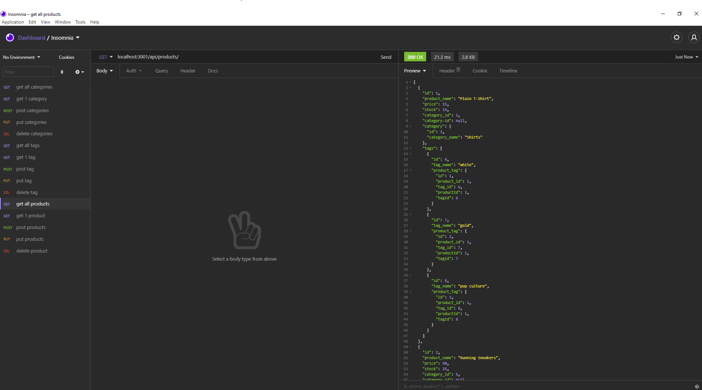

# E-Commerce Back End Database
  
  
## Description 
  
Edited existing code to build back end database for ecommerce website. By using sequelize to enable CRUD paradigm, user is able to use insomnia and edited database info. 


## Table of Contents

* [Installation](#Installation)
* [Usage](#Usage) 
* [Contributing](#Contributing)
* [License](#License)
* [Questions](#Questions)
  

## Installation 
  
Please run the following command to install required software:

```
Npm install, npm run seed, npm start
```


## Usage

These are the technologies and languages use for this project: express.js, mysql2, sequelize, 

Deployed Youtube Link:   https://youtu.be/c23BbPl958E

Github Repository Link: https://github.com/vinhkhamhuynh/e-commerce-back-end
  

  
   
## License 
  


 
This project is licensed under the MIT license. For more information, click here: https://spdx.org/licenses/MIT.html 
 


## Questions
  
Please follow me on Github for more projects: [vinhkhamhuynh](https://github.com/vinhkhamhuynh) 

For any questions or to report issues, please email me at: vinhkhamhuynh@gmail.com
  

